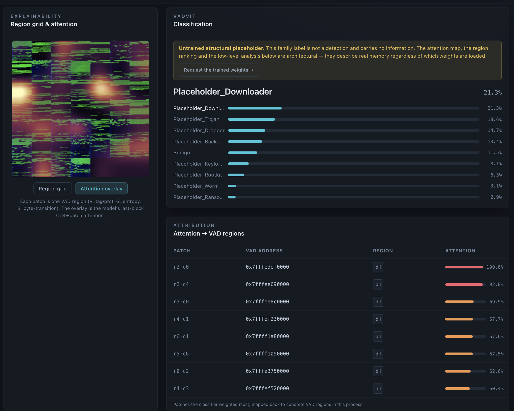
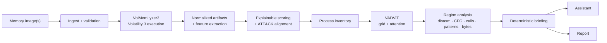

<div align="center">

# MemTriage

**Explainable memory-forensics triage — from raw dump to region-level evidence.**

[](https://www.python.org/)
[](https://react.dev/)
[](https://volatilityfoundation.org/)
[](https://www.docker.com/)
[](https://doi.org/10.1016/j.jisa.2025.104200)
[](security/SCANNING.md)
[](LICENSE)

**DFIR · memory forensics · Volatility 3 · explainable triage · ATT&CK alignment · VAD analysis · Vision Transformers**

[Why MemTriage](#why-memtriage) · [Workflow](#investigation-workflow) · [Workspace](#inside-the-workspace) · [Quick start](#quick-start) · [Architecture](#architecture) · [Research](#research-foundation) · [Security](#security-posture)

</div>

> [!NOTE]
> **MemTriage is an analyst triage aid, not a verdict engine.** It is not an EDR, antivirus product, or live endpoint monitor. Scores, ATT&CK mappings, model attention, and low-level indicators are evidence for review — not proof that a host or process is malicious. See [docs/METHODOLOGY.md](docs/METHODOLOGY.md) for the intended interpretation of each phase.

<p align="center">
  
</p>

## Why MemTriage

Memory forensics is rarely short of artifacts. The difficult part is getting from a multi-gigabyte memory image to a small set of defensible leads **without losing the path that produced them**.

MemTriage is built around that path. It combines broad Volatility-based extraction, transparent scoring, process selection, VADViT attention, region-level reverse engineering, and an optional LLM assistant in one investigation workspace. The aim is not to replace analyst judgment; it is to make the route from **image → artifact → process → region → bytes** easier to follow, inspect, and explain.

MemTriage connects two existing bodies of work:

- **[VolMemLyzer3](https://github.com/YaCnDehfuli/VolMemLyzer3-CLI_forensic_tool)** for repeatable Volatility 3 execution, feature extraction, caching, and analyst-oriented triage.
- **[VADViT](https://github.com/YaCnDehfuli/VADViT)** for process-memory representation, Vision Transformer classification, and attention mapped back to concrete Virtual Address Descriptor (VAD) regions.

The integration adds the investigation state, UI, scoring workflow, region analysis, assistant briefing, reporting, deployment stack, and security controls needed to use those pieces as one application.

## At a glance

| Stage | What happens | What the analyst gets |
| --- | --- | --- |
| **Ingest** | One memory image, or up to five interval snapshots, is validated and streamed to disk. | A bounded investigation input with explicit validation failures. |
| **VolMemLyzer triage** | Volatility plugins run, artifacts are normalized, features are extracted, and explainable rules score the evidence. | Ranked leads with severity, confidence, evidence, and ATT&CK alignment. |
| **Process inventory** | The process set is presented for review and selection. | A concrete PID to investigate rather than a flat wall of plugin output. |
| **VADViT deep-dive** | VAD regions are rendered into the model grid, classified, and attention is mapped back to region addresses. | A ranked list of the regions the model weighted most. |
| **Region analysis** | Selected regions are decoded into instructions, control flow, calls, patterns, strings, structure, PE metadata, entropy, and bytes. | Evidence that can be inspected down to individual addresses. |
| **Assistant & report** | The investigation is packed into a deterministic briefing for an optional LLM and final report. | A question-answering layer that stays anchored to collected evidence, plus an exportable investigation record. |

## Investigation workflow

```text
1. Ingest
      ↓
2. VolMemLyzer triage
      ↓
3. Process inventory
      ↓
4. VADViT deep-dive
      ↓
5. Assistant
      ↓
6. Report
```

### 1. Ingest

Upload a single dump or a short interval sequence. MemTriage checks file count, size, extension, and magic bytes while streaming uploads to disk rather than buffering whole dumps in application memory.

### 2. Triage broadly

VolMemLyzer runs the evidence plan, reuses compatible cached artifacts when possible, extracts stable features, and feeds the normalized output into MemTriage's scoring layer. Sensitivity can be changed without rerunning Volatility: the app rescales the existing evidence instead of hiding the rule contributions behind a single number.

### 3. Pick a process

The process inventory turns the first pass into a review queue. The analyst chooses the PID that deserves deeper analysis rather than letting the model silently choose the next step.

### 4. Follow attention back to memory

VADViT assembles the selected process's VAD regions into the same process-grid representation used by the research pipeline, then maps last-block attention back to specific regions. MemTriage ranks those regions and carries their addresses, protections, backing information, and analysis forward.

### 5. Read the region like code

A suspicious-looking VAD can be inspected through multiple views instead of being reduced to one label: disassembly, basic blocks, control flow, call graph, resolved API names, pattern indicators, strings, PE/section structure, entropy, and hex.

### 6. Ask questions without throwing away provenance

MemTriage builds a deterministic briefing from the investigation and can send it to a supported remote provider or a local model. The assistant is downstream of the evidence; it does not replace the extraction, scoring, or region-analysis stages.

## Inside the workspace

The screenshots below are from the working application, not design mockups.

### VolMemLyzer: triage and feature extraction

The workbench supports automated or manual plugin execution, selectable coverage, concurrency, and cache-aware runs. Extracted features remain inspectable and exportable rather than disappearing into a score.

<table>
<tr>
<td width="50%" valign="top">

<br><sub><strong>Automated triage.</strong> Coverage, plugin selection, concurrency, cache policy, and run status stay visible in one place.</sub>
</td>
<td width="50%" valign="top">

<br><sub><strong>Feature extraction.</strong> Searchable feature output with JSON/CSV export for research and downstream analysis.</sub>
</td>
</tr>
</table>

### VADViT: explainability tied back to VAD regions

The model grid is only useful if the analyst can recover the memory it represents. MemTriage keeps that mapping explicit: high-attention patches are listed beside their VAD addresses and region types, so the next click lands on inspectable bytes rather than an abstract heatmap.

<p align="center">
  
</p>

> [!IMPORTANT]
> The screenshot above deliberately shows the **untrained structural placeholder** state. MemTriage can exercise the complete architecture and explainability path without distributing the research checkpoint, but an untrained model's family label carries no semantic meaning. The UI marks that state explicitly.

### Region analysis: from overview to bytes

Once a VAD is selected, the analyst can move laterally across views without losing the address context.

<table>
<tr>
<td width="50%" valign="top">

<br><sub><strong>Overview.</strong> Address range, protection, backing file, VAD tag, hashes, analysis counts, and triage-aligned ATT&CK techniques.</sub>
</td>
<td width="50%" valign="top">

<br><sub><strong>Disassembly.</strong> Decoded instructions with addresses and bytes; partial decode coverage is shown rather than hidden.</sub>
</td>
</tr>
<tr>
<td width="50%" valign="top">

<br><sub><strong>Call graph.</strong> Local functions, resolved API names, and indirect calls reveal the shape of dynamically resolved behavior.</sub>
</td>
<td width="50%" valign="top">

<br><sub><strong>Patterns.</strong> Decoder loops, PEB walks, writable/executable memory, indirect-call dominance, stack-built strings, and related indicators are surfaced with severity and technique context.</sub>
</td>
</tr>
<tr>
<td width="50%" valign="top">

<br><sub><strong>Structure.</strong> Entropy profile, byte distribution, PE metadata, sections, imports, and image properties help distinguish layout from behavior.</sub>
</td>
<td width="50%" valign="top">

<br><sub><strong>Hex.</strong> A bounded byte view keeps the lowest-level evidence available for manual verification without exposing raw-region downloads.</sub>
</td>
</tr>
</table>

The same analysis surface also includes **control flow** and **strings** views. Indicators describe properties of the bytes in a region; deciding what those properties mean remains an analyst decision.

## Explainability is a design constraint

MemTriage tries to preserve an answer to a simple question at every layer: **"Why am I looking at this?"**

- A triage score keeps the rule contribution, severity, confidence, evidence, and ATT&CK alignment that produced it.
- Cached plugin output can be re-scored without pretending a new forensic collection occurred.
- VADViT attention is mapped back to concrete VAD addresses rather than shown only as an image overlay.
- Region indicators point to bytes, instructions, or structural properties that can be inspected directly.
- ATT&CK technique labels are **alignment for triage**, not confirmed technique detection.
- The assistant receives a deterministic briefing assembled from the investigation, so the conversational layer is downstream of the evidence pipeline.

## Quick start

### Explore the UI in demo mode

The frontend includes a self-contained dataset, so the investigation workspace can be reviewed without a memory image, Volatility, PyTorch, or the backend service.

```bash
git clone https://github.com/YaCnDehfuli/MemTriage.git
cd MemTriage/frontend
npm install
npm run dev
```

Open `http://localhost:5173`. The frontend starts in demo mode; when the API is running, use the Demo/Live toggle in the header.

### Run the full stack

Clone with submodules so both wrapped research/tooling components are present:

```bash
git clone --recurse-submodules https://github.com/YaCnDehfuli/MemTriage.git
cd MemTriage
docker compose -f deploy/docker-compose.yml up --build
```

If the repository was cloned without submodules:

```bash
git submodule update --init --recursive
```

`.env.example` documents the available configuration knobs. Copy it to `.env` when you want to override defaults.

Before a real investigation, check what the current environment can actually provide:

```bash
python -m memtriage.preflight
```

Missing optional components are reported as capabilities that are unavailable, not collapsed into a generic startup failure.

## Architecture



The application is split into a React/TypeScript analyst workspace and a local service stack. FastAPI exposes investigation, upload, process, result, scoring, artifact, event, model-access, and assistant routes. Celery and Redis coordinate long-running work; PostgreSQL stores investigation state; derived artifacts live on disk.

<details>
<summary><strong>Repository layout</strong></summary>

```text
frontend/      React + TypeScript analyst workspace
backend/       FastAPI API, Celery worker, scoring engine, region analysis, assistant
deploy/        Dockerfiles, nginx config, docker-compose stack
components/    Wrapped VolMemLyzer3 and VADViT source trees
models/        Optional VADViT checkpoint placement and model notes
security/      Scanning coverage and triage guidance
```

</details>

## VADViT model access

**MemTriage does not ship the trained VADViT weights.** They are research artifacts and are released by the author on request.

Without the checkpoint, the application builds an architecturally identical model once from a fixed seed. This keeps the grid construction, attention plumbing, region ranking, and low-level deep-dive available for evaluation of the system itself. **The resulting family classification is not meaningful**, and MemTriage marks that state in the verdict, report, and assistant briefing.

To request the trained weights, use the request flow in the deep-dive panel or email **yasindeh@yorku.ca**. See [docs/MODEL_ACCESS.md](docs/MODEL_ACCESS.md) for placement and access details.

## Assistant providers

MemTriage is provider-agnostic at the conversational layer. It can use a request-scoped key for **Anthropic, OpenAI, Groq, OpenRouter, Together, Mistral, xAI, DeepSeek, or Gemini**, or connect to **Ollama** / **LM Studio** for a local workflow.

Remote API keys are used for the request and are not stored or logged. Provider destinations are restricted to the configured allowlist. MemTriage can also generate a runnable script so the conversation can continue outside the application.

## Security posture

Memory images are hostile input by default. The application is designed around that assumption.

- **The worker has no outbound network access.** It runs on an internal-only network with dropped capabilities, no privilege escalation, and bounded memory. Dump bytes are treated as data and never executed.
- **Raw region bytes are not served for download.** Analysts can inspect bounded views in the application without turning the service into a byte-export endpoint.
- **Uploads are constrained and streamed.** Count, size, extension, and denied executable/container magic bytes are checked before the pipeline accepts an investigation input.
- **Dump-derived strings and paths are sanitized** before persistence or rendering; request-derived paths are checked against their expected roots.
- **Assistant secrets are request-scoped.** Keys are neither persisted nor echoed back and may only be sent to an allowed provider.
- **Optional dependencies degrade explicitly.** Missing VADViT weights, PyTorch, Capstone, or Volatility produce a named unavailable state. `GET /api/health/deep` and `python -m memtriage.preflight` expose those capabilities.

The repository scans itself with **Semgrep, Bandit, pip-audit, npm audit, gitleaks, Trivy, CodeQL**, and a **ZAP baseline** against a live container. See [security/SCANNING.md](security/SCANNING.md) for coverage and local commands, and [SECURITY.md](SECURITY.md) for disclosure guidance.

## Research foundation

MemTriage is application software, but one of its core analysis paths comes directly from published academic work. The README therefore keeps research claims separate from what the integrated app itself establishes.

### VADViT

VADViT converts retained process VAD regions into a process-level image representation using VAD metadata, dynamic-window entropy, and byte-transition structure, then uses a Vision Transformer for binary or malware-family classification and attention-based attribution.

The accompanying paper reports **99.2% binary accuracy** for the strongest configuration and **92% macro-averaged F1** for multiclass family classification on **BCCC-MalMem-SnapLog-2025**. Those figures are specific to the dataset, split discipline, training configuration, and checkpoints used in the study; they are not performance claims for arbitrary memory corpora or for the untrained placeholder used when weights are absent.

> Yasin Dehfouli and Arash Habibi Lashkari, **“VADViT: Vision transformer-driven memory forensics for malicious process detection and explainable threat attribution,”** *Journal of Information Security and Applications*, vol. 94, 104200, 2025. DOI: [10.1016/j.jisa.2025.104200](https://doi.org/10.1016/j.jisa.2025.104200)

```bibtex
@article{dehfouli2025vadvit,
  title   = {VADViT: Vision transformer-driven memory forensics for malicious process detection and explainable threat attribution},
  author  = {Dehfouli, Yasin and Lashkari, Arash Habibi},
  journal = {Journal of Information Security and Applications},
  volume  = {94},
  pages   = {104200},
  year    = {2025},
  doi     = {10.1016/j.jisa.2025.104200}
}
```

### VolMemLyzer lineage

MemTriage uses **VolMemLyzer3** as the broad extraction and feature-engineering layer. The V3 repository provides the current Volatility 3 CLI/API, concurrent plugin execution, cached artifact reuse, and ML-ready feature extraction. Earlier VolMemLyzer work is described in:

> A. H. Lashkari, B. Li, T. L. Carrier, and G. Kaur, **“VolMemLyzer: Volatile Memory Analyzer for Malware Classification using Feature Engineering,”** *2021 RDAAPS*, pp. 1–8. DOI: [10.1109/RDAAPS48126.2021.9452028](https://doi.org/10.1109/RDAAPS48126.2021.9452028)

## Boundaries worth keeping visible

- A **high triage score is a lead**, not a malware verdict.
- **Attention is attribution, not causality.** It tells you which input regions influenced the model most, not why a program behaved as it did.
- A **writable/executable region, PEB walk, decoder loop, indirect-call cluster, or stack-built string can occur in legitimate software**. Context matters.
- VADViT's published metrics require the study's data and trained checkpoints; do not transfer them to another corpus without re-evaluation.
- Volatility symbol support, acquisition quality, and what was resident at capture time bound what any downstream analysis can recover.

## Quality checks

```bash
cd backend && python -m pytest && ruff check .
cd frontend && npm run typecheck && npm run build
```

`python -m memtriage.preflight` reports the capabilities available in the current environment before you start a real run.

## Component provenance and licenses

| Component | Role in MemTriage | Upstream license |
| --- | --- | --- |
| **MemTriage** | Integration, investigation state, UI, scoring, region analysis, assistant, reporting, deployment | [MIT](LICENSE) |
| **VolMemLyzer3** | Volatility orchestration, artifacts, feature extraction, triage inputs | GPL v3 or later — see the [upstream repository](https://github.com/YaCnDehfuli/VolMemLyzer3-CLI_forensic_tool) |
| **VADViT** | VAD representation, ViT inference path, attention attribution | MIT — see the [upstream repository](https://github.com/YaCnDehfuli/VADViT) |

Wrapped components retain their own licenses and citation requirements. The table above is a provenance summary, not legal advice; consult each component's license file for the applicable terms.

## Status

The integrated API, worker pipeline, scoring engine, feature view, process workflow, region analysis, assistant, report path, demo mode, Docker stack, security scanning, and test suite are implemented. Real VADViT classification requires the trained weights described above; the rest of the investigation path is designed to remain inspectable without them.

---

<div align="center">

**MemTriage is built for the part of memory forensics between “I have a dump” and “I can explain why this region deserves attention.”**

</div>
