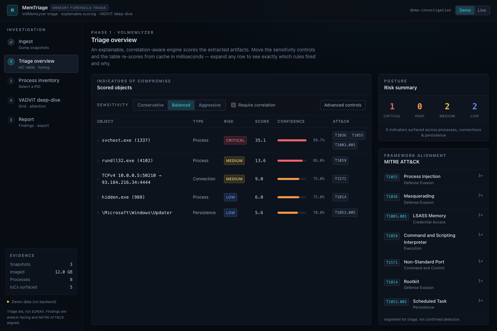
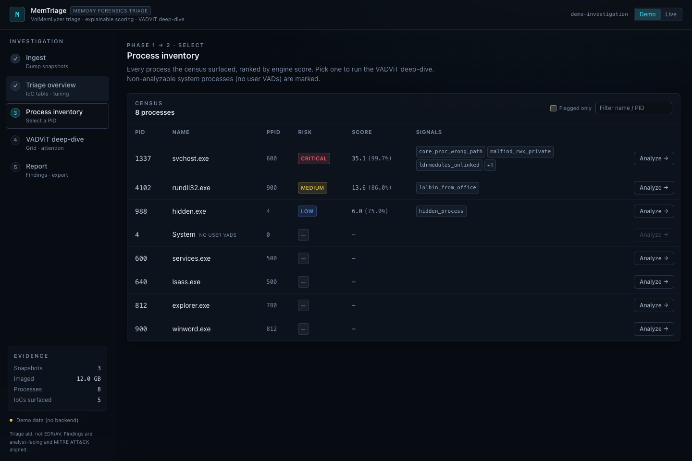
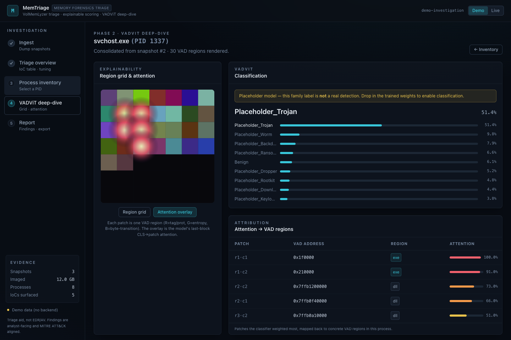

# MemTriage

[](https://www.python.org/)
[](https://react.dev/)
[](https://www.docker.com/)
[](security/SCANNING.md)
[](LICENSE)

**Technical focus:** DFIR · memory forensics · Volatility 3 · ATT&CK-aligned triage · analyst workflow · explainable ML

MemTriage turns one raw memory image, or a short sequence of snapshots from the
same host, into a traceable investigation. It runs broad Volatility-based
artifact extraction, scores what it finds with tunable and explainable rules,
analyses a selected process down to the instruction level, and hands the whole
thing to an LLM of your choosing as a structured briefing you can ask questions
about.

It is a triage aid for analysts. It is not an EDR, an AV product, or a live
endpoint monitor, and it does not tell you whether a host was compromised — see
[docs/METHODOLOGY.md](docs/METHODOLOGY.md) for what each phase does and does not
establish.



## The three phases

**1 · Triage — a fast, wide read.**
[VolMemLyzer3](https://github.com/YaCnDehfuli/VolMemLyzer3-CLI_forensic_tool)
extracts aggregate features and per-object artifacts. A transparent rule engine
scores them, retaining the severity, confidence, evidence and ATT&CK alignment
behind every contribution. Sensitivity is tunable live, re-scoring from cached
plugin output without touching Volatility again. **These are leads, not
conclusions**, and the app says so on the screens where they are read.

**2 · Deep-dive — what the model was looking at.**
For a process you select, [VADViT](https://github.com/YaCnDehfuli/VADViT) renders
its VAD regions into the model grid, classifies, and maps attention back to
concrete regions. Every rendered region is then ranked by attention, and the
highest-ranked ones are analysed as code: an instruction listing, basic blocks
and a control-flow graph, a call graph with resolved API names, byte structure
and entropy, PE headers, strings, and a catalogue of known in-memory patterns —
PEB walks, GetPC gadgets, API hashing, decoder loops, RWX private memory — each
tagged with severity and technique.

**3 · Assistant — ask about what was found.**
Everything from phases 1 and 2 is packed into one deterministic briefing and
cached as the prefix of a conversation. Bring your own key for Anthropic, OpenAI,
Groq, OpenRouter, Together, Mistral, xAI, DeepSeek or Gemini — or point it at a
local Ollama or LM Studio so nothing leaves the machine. The key is used for one
request and is never stored or logged. MemTriage will also generate a runnable
script so the conversation continues outside the app.



## Workflow

1. **Ingest** — upload one dump or up to five interval snapshots. Files stream to
   disk with size, count, extension and magic-byte checks.
2. **Triage** — run extraction once, normalise the evidence, score it.
3. **Inventory** — review the ranked process list and pick a PID.
4. **Deep-dive** — assemble that process's VAD regions, render, classify,
   attribute attention, and analyse the regions it points at.
5. **Assistant** — ask questions against the briefing.
6. **Report** — one investigation record, exportable.

## The model

**MemTriage does not ship VADViT's trained weights.** They are the output of
university research and are released by the author on request.

Nothing is disabled by their absence. The app builds an architecturally identical
*untrained* model once, from a fixed seed, so classification, the attention map,
the region ranking and the entire low-level deep-dive all still run. Only the
family label is meaningless, and it is marked as such in the verdict, in the
report and in the text the assistant reads.

To request the trained weights, use the form on the deep-dive panel or email
**yasindeh@yorku.ca**. Details: [docs/MODEL_ACCESS.md](docs/MODEL_ACCESS.md).

## Architecture

MemTriage wraps two independently published components rather than forking them,
and connects them through a local service stack:

```text
frontend/      React + TypeScript analyst workspace
backend/       FastAPI API, Celery worker, scoring engine, region analysis, assistant
deploy/        Dockerfiles, nginx config, docker-compose stack
components/    Wrapped VolMemLyzer3 and VADViT source trees
models/        Optional VADViT checkpoint placement and model notes
security/      Scanning coverage and triage guidance
```

FastAPI exposes investigation, upload, process, result, scoring, artifact, event,
model-access and assistant routes. Celery and Redis coordinate long-running jobs,
PostgreSQL stores investigation state, and derived artifacts live on disk.



## Security posture

Memory images are untrusted input, and the design treats them that way.

- **The worker has no outbound network access** — internal-only network, dropped
  capabilities, no privilege escalation, bounded memory. Dump bytes are read as
  data and never executed. Raw region bytes are never served for download.
- **Volatility's one required fetch goes through an allowlisting proxy.** Windows
  images need a kernel PDB from Microsoft or every plugin fails; a small
  standard-library proxy grants exactly that host, upgrades the fetch from
  cleartext to TLS, and logs every decision. See [docs/SYMBOLS.md](docs/SYMBOLS.md).
- **Uploads are constrained** by file count, size, extension and denied
  executable/container magic bytes, and stream to disk rather than into memory.
- **Everything dump-derived is sanitised** before it is persisted or rendered,
  and every path built from a request is checked against its own root.
- **Assistant keys are request-scoped** — never persisted, never logged, never
  echoed in a response — and can only be sent to a provider on the allowlist.
- **The pipeline degrades rather than failing.** A missing checkpoint, PyTorch,
  Capstone, or Volatility produces an explicit "unavailable, and here is why"
  state; `GET /api/health/deep` and `python -m memtriage.preflight` report which.

The project scans itself on every push: Semgrep, Bandit, pip-audit, npm audit,
gitleaks, Trivy, CodeQL, and a ZAP baseline against a live container. Coverage
and local commands: [security/SCANNING.md](security/SCANNING.md). Disclosure
policy: [SECURITY.md](SECURITY.md).

## Demo mode

The frontend ships a self-contained dataset so the whole workspace — including
the region deep-dive and the assistant — is reviewable with no backend,
Volatility, memory image, or PyTorch.

```bash
cd frontend
npm install
npm run dev
```

Open `http://localhost:5173`. It starts in demo mode; use the Demo/Live toggle in
the header when running against the API.

## Full stack

Clone with submodules so the wrapped components are present:

```bash
git clone --recurse-submodules https://github.com/YaCnDehfuli/MemTriage.git
cd MemTriage
docker compose -f deploy/docker-compose.yml up --build
```

If the repository was cloned without submodules: `git submodule update --init
--recursive`.

Copy `.env.example` to `.env` to change any defaults; every setting is documented
there.

## Quality checks

```bash
cd backend && python -m pytest && ruff check .
cd frontend && npm run typecheck && npm run build
```

`python -m memtriage.preflight` reports what the current environment can actually
do — missing optional components are warnings, not failures.

## Status

The API, worker pipeline, scoring engine, region analysis, assistant, analyst
workspace, demo mode, Docker stack, security scanning and test suite are in
place. Real VADViT classification requires the trained weights described above;
everything else runs without them.

## License

[MIT](LICENSE). Wrapped components retain their own licenses and citations.
