# MemTriage

Memory-forensics workspace that runs Volatility 3 triage, re-scores cached artifacts, and maps VADViT attention back to process regions.

[](https://www.python.org/)
[](https://react.dev/)
[](https://volatilityfoundation.org/)
[](https://doi.org/10.1016/j.jisa.2025.104200)
[](LICENSE)

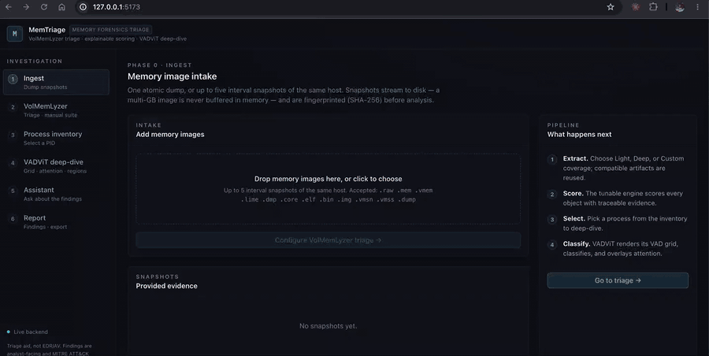

Work in progress. Not an EDR, antivirus, or live endpoint monitor. Without a compatible VADViT checkpoint the system returns an explicit unavailable result.

One dump, or up to five interval snapshots, is uploaded through FastAPI. Celery workers run Volatility 3 through VolMemLyzer, persist artifacts in PostgreSQL and on disk, and stream progress over SSE. The React workspace re-scores cached plugin output without starting Volatility again. Selecting a process runs `windows.vadinfo --dump`, renders a VADViT grid, and ranks regions by attention. Region panels include disassembly, control flow, strings, entropy, and a bounded hex view.

The GIF above is a live Docker run against `2580_5.vmem` with Prefer cache. Regenerating it is documented in [docs/demo/README.md](docs/demo/README.md).

## Quickstart

```bash
git clone --recurse-submodules https://github.com/YaCnDehfuli/MemTriage.git
cd MemTriage
docker compose -f deploy/docker-compose.yml up --build
```

Open `http://127.0.0.1:5173`. Upload a memory image, leave Prefer cache selected, and run triage. Compatible VolMemLyzer artifacts next to the image, or from a prior investigation of the same SHA-256, are reused.

```bash
docker compose -f deploy/docker-compose.yml exec api python -m memtriage.preflight
```

Missing Volatility, Capstone, PyTorch, or a VADViT checkpoint is reported as a named unavailable capability.

## Workspace

| Stage | What the analyst gets |
| --- | --- |
| Ingest | One dump or up to five snapshots, streamed to disk and hashed. |
| Triage | Ranked leads with severity, confidence, evidence, and ATT&CK alignment. |
| Inventory | Processes ranked by score. The analyst picks the PID. |
| VADViT | Attention overlay and a top-K region table, or an explicit unavailable verdict. |
| Region analysis | Disassembly, graphs, patterns, strings, structure, entropy, hex. |

<p align="center">
  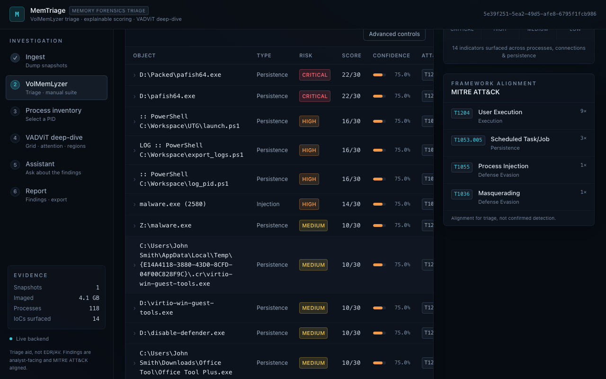
</p>

<p align="center">
  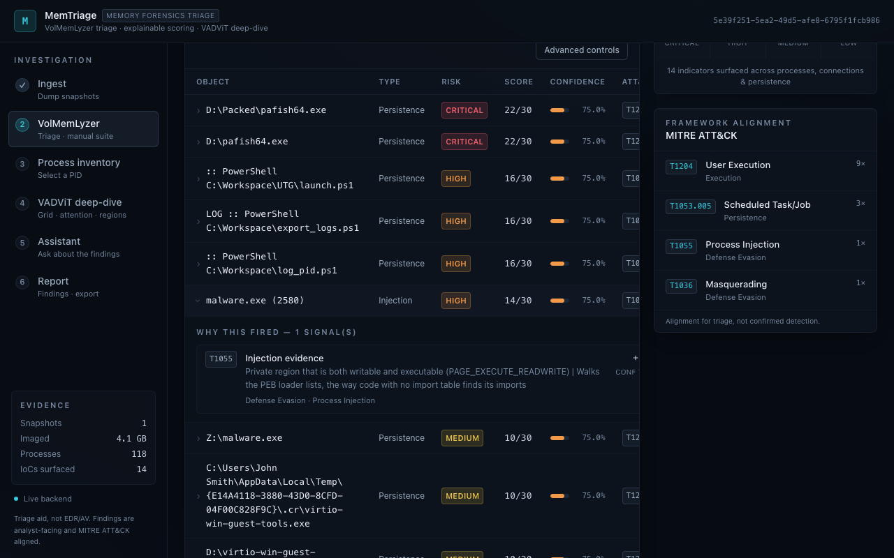
</p>

<p align="center">
  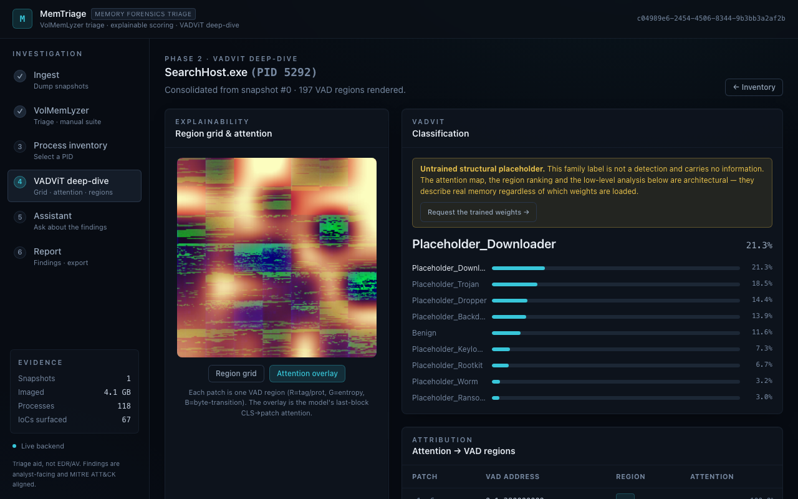
</p>

The GIF walks ingest → triage → a process. These stills are the region views it does not hold on: the function-call graph, disassembly, entropy / PE layout, and the other analyst tabs.

<table>
<tr>
<td width="50%" valign="top">
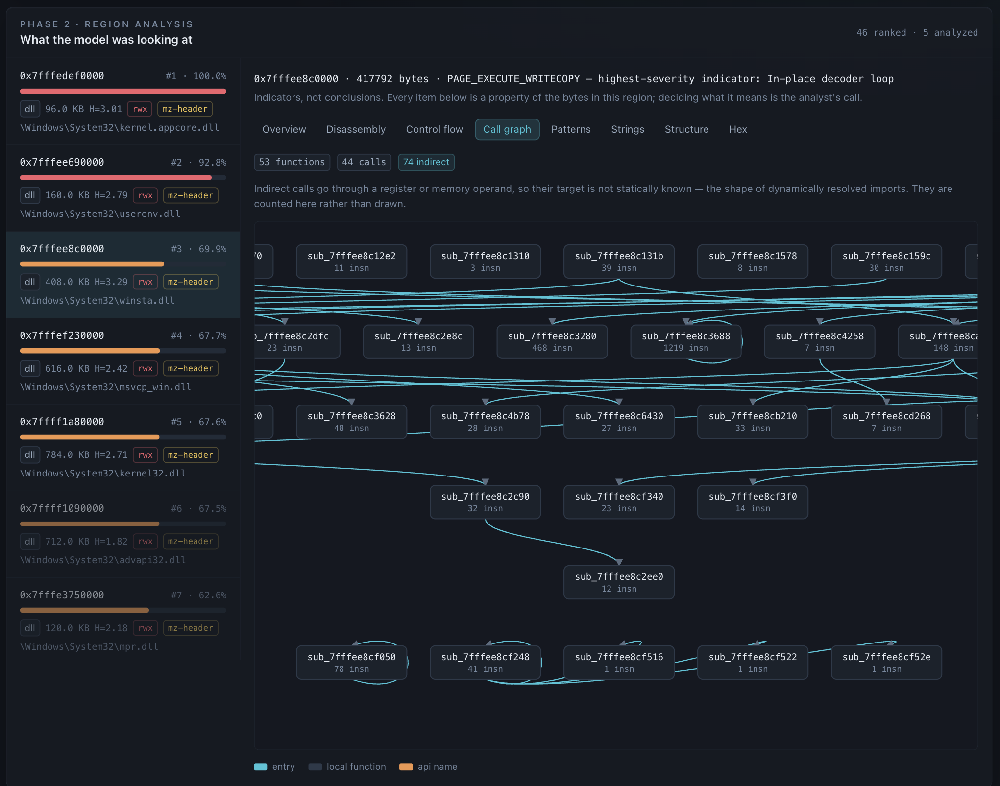
<br><sub><strong>Call graph (FCG).</strong> Local functions, resolved API names, and indirect calls. Indirect calls are counted rather than drawn.</sub>
</td>
<td width="50%" valign="top">
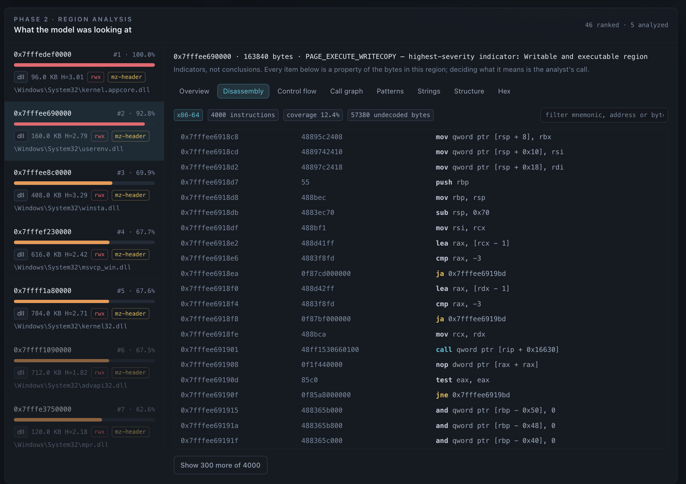
<br><sub><strong>Disassembly.</strong> Decoded instructions with addresses and bytes; partial decode coverage is shown rather than hidden.</sub>
</td>
</tr>
<tr>
<td width="50%" valign="top">
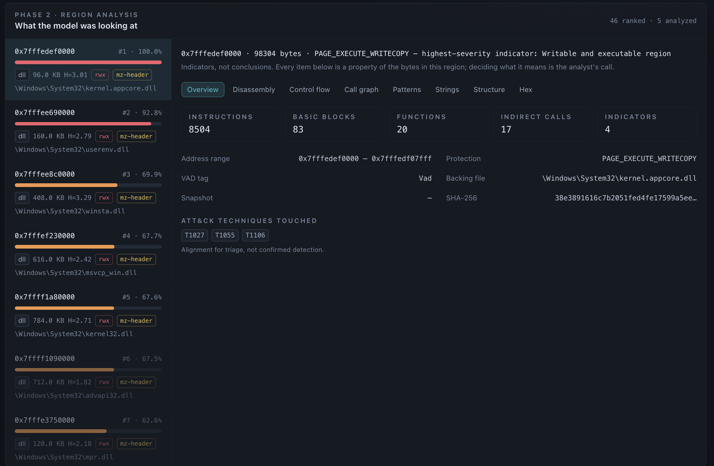
<br><sub><strong>Overview.</strong> Address range, protection, backing file, hashes, analysis counts, and triage-aligned ATT&CK techniques. The Control flow (CFG) tab sits next to Call graph.</sub>
</td>
<td width="50%" valign="top">
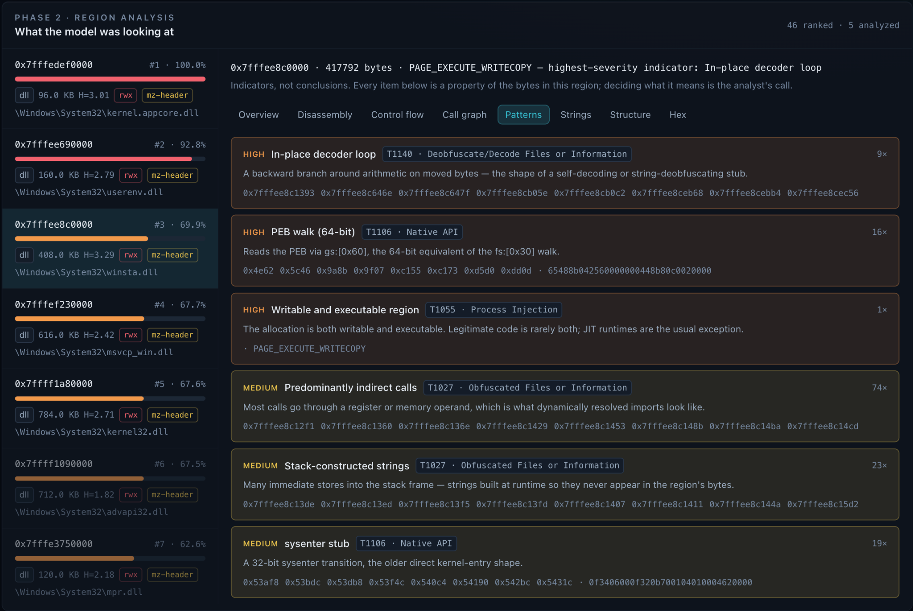
<br><sub><strong>Patterns.</strong> Decoder loops, PEB walks, writable/executable memory, indirect-call dominance, and stack-built strings, with severity and technique context.</sub>
</td>
</tr>
<tr>
<td width="50%" valign="top">
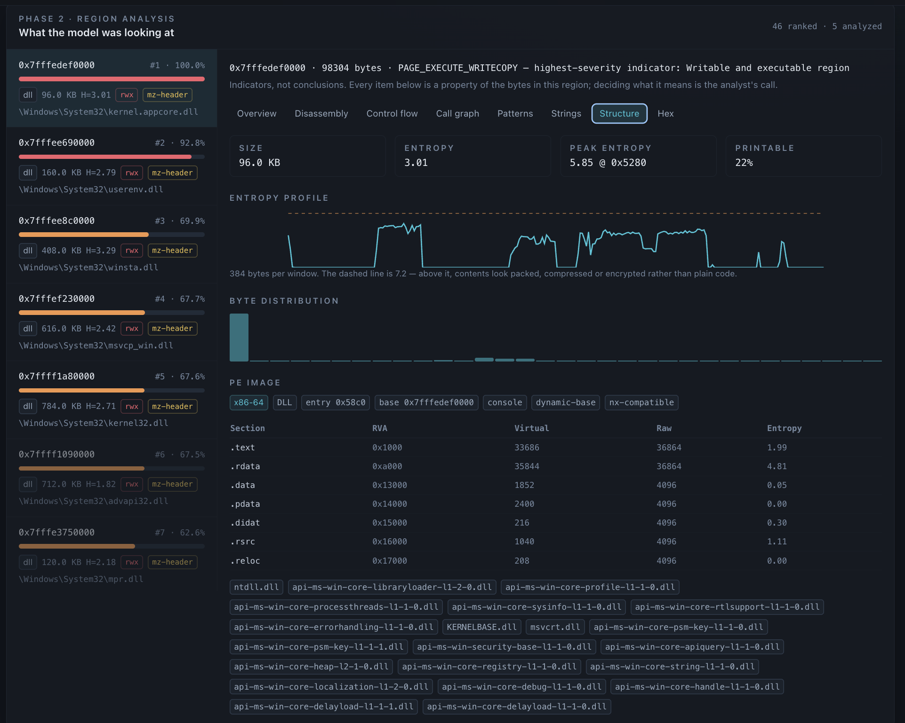
<br><sub><strong>Structure.</strong> Entropy profile, byte distribution, PE metadata, sections, and imports — layout as distinct from behavior.</sub>
</td>
<td width="50%" valign="top">
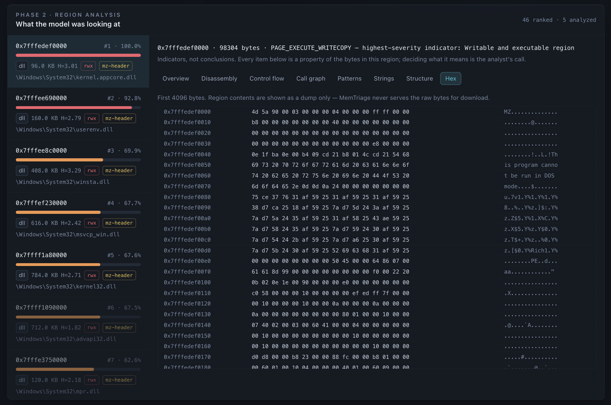
<br><sub><strong>Hex.</strong> A bounded byte view for manual verification. Raw region bytes are not served for download.</sub>
</td>
</tr>
</table>

<p align="center">
  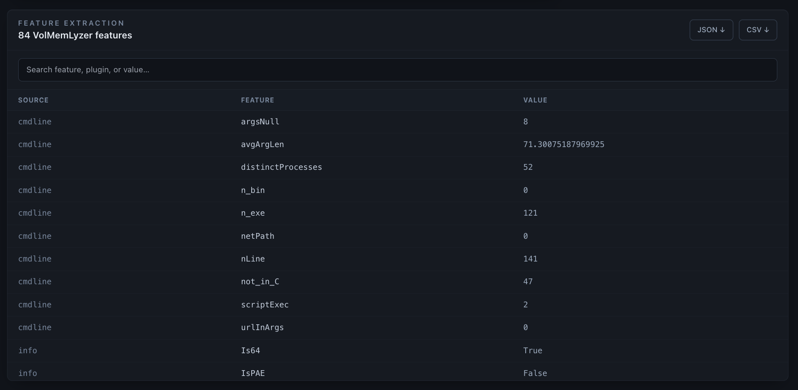
</p>
<sub>Feature extraction. Searchable VolMemLyzer features with JSON/CSV export — a table the GIF does not pause on.</sub>

## Status

Work in progress. Not an EDR, antivirus, or live endpoint monitor. Without a compatible VADViT checkpoint the system returns an explicit unavailable result.

The stack is FastAPI, Celery, PostgreSQL, Redis, SSE, React/TypeScript, Docker Compose, and nginx. The trained VADViT weights are not in this repository. Request them via the deep-dive panel or [docs/MODEL_ACCESS.md](docs/MODEL_ACCESS.md).

## Limitations

- A high triage score is a lead, not a malware verdict.
- ATT&CK labels are alignment for triage, not confirmed technique detection.
- Attention ranks input regions. It does not explain why a program behaved as it did.
- Writable/executable memory, PEB walks, decoder loops, and indirect calls also occur in legitimate software.
- VADViT published metrics (99.2% binary accuracy, 92% macro-averaged F1 on BCCC-MalMem-SnapLog-2025) belong to the study that produced those checkpoints. They do not transfer to this workspace without those weights and that corpus.
- Volatility symbol support, acquisition quality, and what was resident at capture time bound every later stage.

See [docs/METHODOLOGY.md](docs/METHODOLOGY.md).

## Citation

> Yasin Dehfouli and Arash Habibi Lashkari, **“VADViT: Vision transformer-driven memory forensics for malicious process detection and explainable threat attribution,”** *Journal of Information Security and Applications*, vol. 94, 104200, 2025. DOI: [10.1016/j.jisa.2025.104200](https://doi.org/10.1016/j.jisa.2025.104200)

```bibtex
@article{dehfouli2025vadvit,
  title   = {VADViT: Vision transformer-driven memory forensics for malicious process detection and explainable threat attribution},
  author  = {Dehfouli, Yasin and Lashkari, Arash Habibi},
  journal = {Journal of Information Security and Applications},
  volume  = {94},
  pages   = {104200},
  year    = {2025},
  doi     = {10.1016/j.jisa.2025.104200}
}
```
