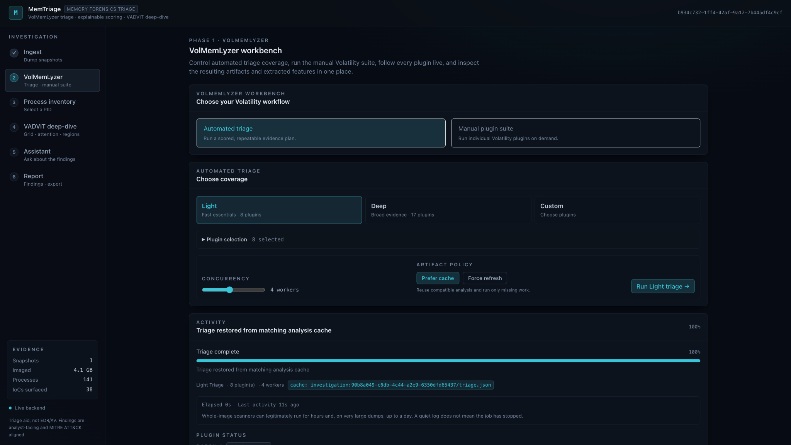

# MemTriage

Memory-forensics workspace that runs Volatility 3 triage, re-scores cached artifacts, and maps VADViT attention back to process regions.

[](https://www.python.org/)
[](https://react.dev/)
[](https://volatilityfoundation.org/)
[](https://doi.org/10.1016/j.jisa.2025.104200)
[](LICENSE)


Stable tool. Not an EDR, antivirus, or live endpoint monitor. The trained VADViT checkpoint is obtained through the research facility (BCCC / York) on request; it is not shipped in this repository.

One dump, or up to five interval snapshots, is uploaded through FastAPI. Celery workers run Volatility 3 through VolMemLyzer, persist artifacts in PostgreSQL and on disk, and stream progress over SSE. The React workspace re-scores cached plugin output without starting Volatility again. Selecting a process runs `windows.vadinfo --dump`, renders a VADViT grid, and ranks regions by attention. Region panels include disassembly, a control-flow graph (CFG), a function-call graph (FCG), patterns, strings, structure, entropy, and a bounded hex view.

The GIF above is a live Docker run against `2580_5.vmem` with Prefer cache. Regenerating it is documented in [docs/demo/README.md](docs/demo/README.md).

## Quickstart

```bash
git clone --recurse-submodules https://github.com/YaCnDehfuli/MemTriage.git
cd MemTriage
docker compose -f deploy/docker-compose.yml up --build
```

Open `http://127.0.0.1:5173`. Upload a memory image, leave Prefer cache selected, and run triage. Compatible VolMemLyzer artifacts next to the image, or from a prior investigation of the same SHA-256, are reused.

```bash
docker compose -f deploy/docker-compose.yml exec api python -m memtriage.preflight
```

Missing Volatility, Capstone, PyTorch, or a VADViT checkpoint is reported as a named unavailable capability.

`.env.example` documents the configuration knobs. Copy it to `.env` to override defaults.

## How it works

Memory forensics is rarely short of artifacts. The hard part is getting from a multi-gigabyte image to a small set of defensible leads without losing the path that produced them.

MemTriage connects two existing bodies of work:

- **[VolMemLyzer3](https://github.com/YaCnDehfuli/VolMemLyzer3-CLI_forensic_tool)** for Volatility 3 execution, feature extraction, caching, and analyst-oriented triage.
- **[VADViT](https://github.com/YaCnDehfuli/VADViT)** for process-memory representation, Vision Transformer classification, and attention mapped back to concrete Virtual Address Descriptor (VAD) regions.

| Stage | What happens | What the analyst gets |
| --- | --- | --- |
| Ingest | One image, or up to five interval snapshots, is validated and streamed to disk. | A bounded input with explicit validation failures. |
| VolMemLyzer triage | Volatility plugins run, artifacts are normalized, features are extracted, and explainable rules score the evidence. | Ranked leads with severity, confidence, evidence, and ATT&CK alignment. |
| Process inventory | The process set is presented for review and selection. | A concrete PID rather than a wall of plugin output. |
| VADViT deep-dive | VAD regions are rendered into the model grid, classified, and attention is mapped back to region addresses. | A ranked list of the regions the model weighted most. |
| Region analysis | Selected regions are decoded into instructions, a CFG, an FCG, patterns, strings, PE layout, entropy, and bytes. | Evidence that can be inspected down to individual addresses. |
| Assistant and report | The investigation is packed into a deterministic briefing for an optional LLM and a final report. | A question-answering layer anchored to collected evidence, plus an exportable record. |

Sensitivity can be changed without rerunning Volatility: the app rescales existing evidence instead of hiding rule contributions behind a single number. The analyst chooses the PID. See [docs/METHODOLOGY.md](docs/METHODOLOGY.md).

## Workspace

The GIF walks ingest → triage → a process. The stills below are the region-level and feature views it does not hold on — including the CFG/FCG graph tabs.

<p align="center">
  
</p>

<p align="center">
  
</p>
<sub>VolMemLyzer workbench. Coverage, plugin selection, concurrency, cache policy, and run status stay visible in one place.</sub>

<p align="center">
  
</p>
<sub>Feature extraction. Searchable VolMemLyzer features with JSON/CSV export.</sub>

<p align="center">
  
</p>

> [!IMPORTANT]
> The VADViT panel above shows the **untrained structural placeholder** when the research-facility checkpoint is not mounted. Grid construction, attention, region ranking, and the low-level deep-dive still describe real memory. The family label does not. The UI marks that state and offers the request form.

### Region analysis: CFG, FCG, and the other tabs

Once a VAD is selected, the analyst can move across views without losing the address context. **Control flow** is the CFG (basic blocks and typed edges). **Call graph** is the FCG (local functions, resolved APIs, indirect calls).

<table>
<tr>
<td width="50%" valign="top">

<br><sub><strong>Overview.</strong> Address range, protection, backing file, hashes, analysis counts, and triage-aligned ATT&CK techniques. Control flow (CFG) and Call graph (FCG) are adjacent tabs.</sub>
</td>
<td width="50%" valign="top">

<br><sub><strong>Disassembly.</strong> Decoded instructions with addresses and bytes; partial decode coverage is shown rather than hidden.</sub>
</td>
</tr>
<tr>
<td width="50%" valign="top">

<br><sub><strong>Call graph (FCG).</strong> Local functions, resolved API names, and indirect calls. Indirect calls are counted rather than drawn because their targets are not statically known.</sub>
</td>
<td width="50%" valign="top">

<br><sub><strong>Patterns.</strong> Decoder loops, PEB walks, writable/executable memory, indirect-call dominance, and stack-built strings, with severity and technique context.</sub>
</td>
</tr>
<tr>
<td width="50%" valign="top">

<br><sub><strong>Structure.</strong> Entropy profile, byte distribution, PE metadata, sections, and imports — layout as distinct from behavior.</sub>
</td>
<td width="50%" valign="top">

<br><sub><strong>Hex.</strong> A bounded byte view for manual verification. Raw region bytes are not served for download.</sub>
</td>
</tr>
</table>

The same analysis surface also includes the **control-flow graph (CFG)** and **strings** views. Indicators describe properties of the bytes in a region; deciding what those properties mean remains an analyst decision.

<p align="center">
  
</p>
<sub>Evidence expansion. A scored object opens to the rule, severity, confidence, and evidence string that produced it.</sub>

## Architecture

```text
Memory image(s)
      ↓
Ingest + validation
      ↓
VolMemLyzer3 / Volatility 3
      ↓
Normalized artifacts + features
      ↓
Explainable scoring + ATT&CK alignment
      ↓
Process inventory
      ↓
VADViT grid + attention
      ↓
Region analysis (disasm · CFG · FCG · patterns · bytes)
      ↓
Deterministic briefing → Assistant / Report
```

FastAPI exposes investigation, upload, process, result, scoring, artifact, event, model-access, and assistant routes. Celery and Redis coordinate long-running work; PostgreSQL stores investigation state; derived artifacts live on disk.

## VADViT model access

**MemTriage does not ship the trained VADViT weights.** They are research artifacts. The checkpoint is obtained through the research facility (BCCC / York) on request, then placed in `models/`.

Without the checkpoint, the application builds an architecturally identical model once from a fixed seed. Grid construction, attention plumbing, region ranking, and the low-level deep-dive stay available. **The resulting family classification is not meaningful**, and MemTriage marks that state in the verdict, report, and assistant briefing.

To request the trained weights, use the form on the VADViT deep-dive panel or email **yasindeh@yorku.ca**. See [docs/MODEL_ACCESS.md](docs/MODEL_ACCESS.md) for placement and access details.

## Limitations

- A high triage score is a lead, not a malware verdict.
- ATT&CK labels are alignment for triage, not confirmed technique detection.
- Attention ranks input regions. It does not explain why a program behaved as it did.
- Writable/executable memory, PEB walks, decoder loops, and indirect calls also occur in legitimate software.
- VADViT published metrics (99.2% binary accuracy, 92% macro-averaged F1 on BCCC-MalMem-SnapLog-2025) belong to the study that produced those checkpoints. They do not transfer to this workspace without those weights and that corpus.
- Volatility symbol support, acquisition quality, and what was resident at capture time bound every later stage.

## Status

The integrated API, worker pipeline, scoring engine, feature view, process workflow, region analysis (including CFG and FCG), assistant, report path, Docker stack, security scanning, and test suite are implemented. This repository is not under development as a WIP product and is not an EDR, antivirus, or live endpoint monitor.

The trained VADViT model is obtained through the research facility (BCCC / York) on request — via the deep-dive form or **yasindeh@yorku.ca** — and is not bundled here. Without that checkpoint the rest of the investigation path stays inspectable; family labels from the placeholder are not detections.

## Citation

> Yasin Dehfouli and Arash Habibi Lashkari, **“VADViT: Vision transformer-driven memory forensics for malicious process detection and explainable threat attribution,”** *Journal of Information Security and Applications*, vol. 94, 104200, 2025. DOI: [10.1016/j.jisa.2025.104200](https://doi.org/10.1016/j.jisa.2025.104200)

```bibtex
@article{dehfouli2025vadvit,
  title   = {VADViT: Vision transformer-driven memory forensics for malicious process detection and explainable threat attribution},
  author  = {Dehfouli, Yasin and Lashkari, Arash Habibi},
  journal = {Journal of Information Security and Applications},
  volume  = {94},
  pages   = {104200},
  year    = {2025},
  doi     = {10.1016/j.jisa.2025.104200}
}
```
